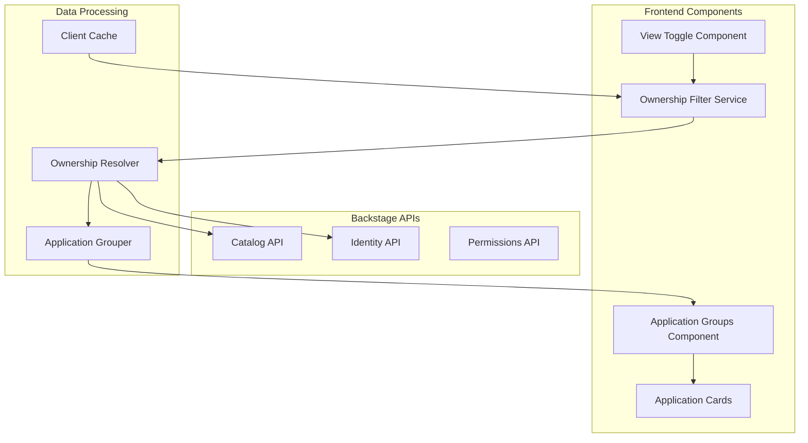
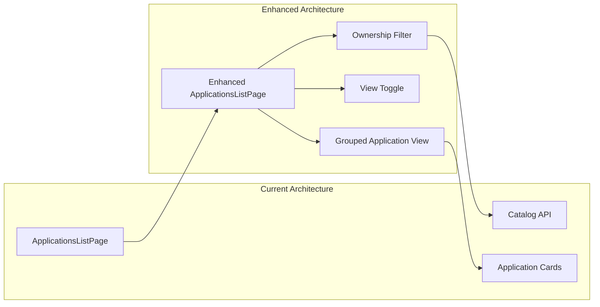

# Design Document

## Overview

The deployment ownership filtering feature enhances the existing Backstage deployment plugin by implementing user-centric application filtering and organizational grouping. The design leverages Backstage's catalog ownership model to provide personalized views while maintaining access to the full organizational deployment landscape. The solution integrates seamlessly with the existing plugin architecture and maintains backward compatibility with current functionality.

## Architecture

### High-Level Architecture



### Integration with Existing Plugin

The ownership filtering feature extends the existing `ApplicationsListPage` component without breaking changes:



## Components and Interfaces

### Frontend Components

#### 1. Enhanced ApplicationsListPage
- **Purpose**: Main page component with ownership filtering and grouping
- **Location**: `/deployments` (existing route)
- **New Features**:
  - View toggle between "My Applications" and "All Applications"
  - Ownership-based filtering
  - Grouped application display
  - Access indication for non-owned applications

#### 2. ViewToggleComponent
- **Purpose**: Toggle control for switching between filtered and full views
- **Props**: 
  ```typescript
  interface ViewToggleProps {
    currentView: 'owned' | 'all';
    onViewChange: (view: 'owned' | 'all') => void;
    ownedCount: number;
    totalCount: number;
  }
  ```
- **Features**:
  - Toggle switch or button group
  - Application count display
  - Session persistence

#### 3. ApplicationGroupComponent
- **Purpose**: Display applications grouped by owner
- **Props**:
  ```typescript
  interface ApplicationGroupProps {
    owner: OwnerInfo;
    applications: ComponentEntity[];
    currentUser: string;
    showAccessIndicators: boolean;
  }
  ```
- **Features**:
  - Collapsible group sections
  - Owner information display
  - Application count per group
  - Special handling for "Unassigned" applications (no owner specified)
  - Primary owner selection for applications with multiple owners

#### 4. AccessIndicatorComponent
- **Purpose**: Visual indicator for applications with potential access limitations
- **Props**:
  ```typescript
  interface AccessIndicatorProps {
    hasAccess: boolean;
    ownerInfo: OwnerInfo;
    tooltipContent?: string;
  }
  ```
- **Features**:
  - Icon or badge display
  - Tooltip with access information
  - Consistent styling

### Services and Utilities

#### 1. OwnershipResolver Service
```typescript
interface OwnershipResolver {
  resolveUserOwnership(
    user: BackstageUserIdentity,
    applications: ComponentEntity[]
  ): Promise<OwnedApplications>;
  
  resolveGroupMembership(
    user: BackstageUserIdentity,
    groups: string[]
  ): Promise<string[]>;
  
  determineApplicationAccess(
    user: BackstageUserIdentity,
    application: ComponentEntity
  ): Promise<AccessLevel>;
}

interface OwnedApplications {
  directlyOwned: ComponentEntity[];
  groupOwned: ComponentEntity[];
  allOwned: ComponentEntity[];
}

type AccessLevel = 'full' | 'limited' | 'none';
```

#### 2. ApplicationGrouper Service
```typescript
interface ApplicationGrouper {
  groupByOwner(
    applications: ComponentEntity[],
    ownershipData: OwnershipData
  ): ApplicationGroup[];
  
  sortGroups(groups: ApplicationGroup[]): ApplicationGroup[];
}

interface ApplicationGroup {
  owner: OwnerInfo;
  applications: ComponentEntity[];
  isUserGroup: boolean;
  accessLevel: AccessLevel;
}

interface OwnerInfo {
  type: 'user' | 'group';
  name: string;
  displayName: string;
  avatar?: string;
}
```

#### 3. ViewStateManager
```typescript
interface ViewStateManager {
  getCurrentView(): ViewMode;
  setCurrentView(view: ViewMode): void;
  getFilteredApplications(
    applications: ComponentEntity[],
    view: ViewMode,
    user: BackstageUserIdentity
  ): Promise<ComponentEntity[]>;
}

type ViewMode = 'owned' | 'all';
```

## Data Models

### Enhanced Types

```typescript
// Extended application data with ownership information
interface EnhancedComponentEntity extends ComponentEntity {
  ownershipInfo: {
    owners: OwnerInfo[];
    primaryOwner: OwnerInfo;
    userHasAccess: boolean;
    accessLevel: AccessLevel;
  };
}

// Ownership resolution result
interface OwnershipData {
  userOwned: Set<string>; // component names
  groupOwned: Map<string, string[]>; // group -> component names
  ownerMap: Map<string, OwnerInfo>; // component name -> owner info
  userGroups: string[];
}

// View state
interface ViewState {
  mode: ViewMode;
  filteredApplications: EnhancedComponentEntity[];
  groupedApplications: ApplicationGroup[];
  loading: boolean;
  error?: string;
}
```

### Backstage Integration Types

```typescript
// Catalog entity ownership extension
interface CatalogOwnershipQuery {
  entityRef: string;
  owner?: string;
  relations: {
    ownedBy: EntityRelation[];
    memberOf: EntityRelation[];
  };
}

// User identity with group membership
interface ExtendedUserIdentity extends BackstageUserIdentity {
  groups: string[];
  permissions: string[];
}
```

## Implementation Strategy

### Phase 1: Core Ownership Resolution

1. **Ownership Resolver Implementation**
   - Create service to resolve user and group ownership
   - Implement caching for ownership data
   - Add error handling for catalog API failures

2. **View State Management**
   - Implement view toggle functionality
   - Add session persistence for view preference
   - Create filtered application logic

### Phase 2: Grouping and Display

1. **Application Grouper**
   - Implement grouping logic by owner
   - Add sorting and organization features
   - Handle edge cases (no owner, multiple owners)

2. **Enhanced UI Components**
   - Update ApplicationsListPage with new features
   - Create ViewToggle component
   - Implement ApplicationGroup component

### Phase 3: Access Indicators and Polish

1. **Access Level Detection**
   - Implement GitHub access checking
   - Add visual indicators for access levels
   - Create helpful error messages

2. **Performance Optimization**
   - Implement efficient caching strategies
   - Add progressive loading for large datasets
   - Optimize re-rendering on view changes

## Error Handling

### Ownership Resolution Errors
- **Catalog API Failures**: Fall back to showing all applications with warning message (Requirement 5.5)
- **Identity Resolution Failures**: Fall back to unfiltered view (Requirement 5.6)
- **Group Membership Errors**: Show applications with unknown ownership status
- **Missing Ownership Information**: Handle gracefully without breaking application list (Requirement 5.4)

### Access Level Errors
- **GitHub Permission Errors**: Display clear error messages with guidance
- **Network Failures**: Provide retry mechanisms
- **Rate Limiting**: Implement graceful degradation

### UI Error States
```typescript
interface ErrorState {
  type: 'ownership' | 'catalog' | 'github' | 'network';
  message: string;
  recoverable: boolean;
  retryAction?: () => void;
}
```

## Performance Considerations

### Caching Strategy
- **Ownership Data**: Cache for 5 minutes to reduce catalog API calls
- **Group Membership**: Cache for 10 minutes (changes infrequently)
- **Application Metadata**: Leverage existing catalog caching
- **View State**: Persist in session storage

### Optimization Techniques
- **Lazy Loading**: Load ownership data progressively
- **Memoization**: Cache expensive computations (grouping, filtering)
- **Debouncing**: Debounce view toggle changes
- **Virtual Scrolling**: For large application lists (future enhancement)

### Performance Metrics
- Initial page load: < 2 seconds
- View toggle response: < 500ms
- Ownership resolution: < 1 second
- Group rendering: < 300ms per group

## Security Considerations

### Data Access
- Respect Backstage catalog permissions
- Don't expose ownership data user shouldn't see
- Validate user identity before filtering

### GitHub Integration
- Maintain existing GitHub permission model
- Don't bypass existing access controls
- Provide clear feedback on permission limitations

## Testing Strategy

### Unit Testing
- Ownership resolver logic
- Application grouping algorithms
- View state management
- Error handling scenarios

### Integration Testing
- Catalog API integration
- Identity API integration
- End-to-end ownership resolution

### User Experience Testing
- View toggle functionality
- Group expansion/collapse
- Error state handling
- Performance with large datasets

## Migration Strategy

### Backward Compatibility
- Existing functionality remains unchanged
- New features are additive only
- No breaking changes to existing APIs

### Feature Rollout
1. **Phase 1**: Deploy with feature flag disabled
2. **Phase 2**: Enable for pilot users/teams
3. **Phase 3**: Full rollout with monitoring
4. **Phase 4**: Make ownership filtering default behavior

### Configuration Options
```yaml
# app-config.yaml
deployments:
  ownership:
    enabled: true
    defaultView: 'owned' # or 'all'
    grouping:
      enabled: true
      sortBy: 'name' # or 'count'
    caching:
      ownershipTtl: 300 # 5 minutes
      groupMembershipTtl: 600 # 10 minutes
```

## Future Enhancements

### Advanced Filtering
- Filter by specific teams/groups
- Search within owned applications
- Custom ownership rules

### Enhanced Grouping
- Hierarchical group display
- Multiple grouping criteria
- Custom group ordering

### Analytics and Insights
- Usage metrics for ownership filtering
- Popular applications by team
- Access pattern analysis