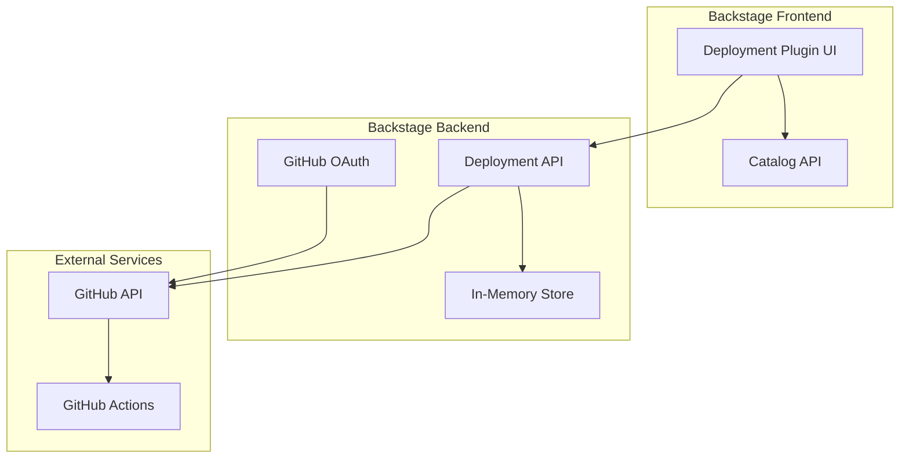

# Design Document

## Overview

The Backstage Deployment Plugin MVP provides a unified interface for managing deployments across GitHub Actions workflows. The plugin integrates with Backstage's existing GitHub OAuth authentication and uses component annotations to identify applications eligible for deployment management. The design follows Backstage's three-package plugin architecture with a React frontend, Express backend, and shared common types.

## Architecture

### High-Level Architecture



### Plugin Architecture

The plugin follows Backstage's standard three-package structure:

1. **Frontend Plugin** (`@internal/plugin-deployments`)
   - React components and UI logic
   - Routing and navigation
   - State management for UI

2. **Backend Plugin** (`@internal/plugin-deployments-backend`)
   - REST API endpoints
   - GitHub API integration
   - Environment configuration storage

3. **Common Package** (`@internal/plugin-deployments-common`)
   - Shared TypeScript types
   - API contracts
   - Constants and utilities

## Components and Interfaces

### Frontend Components

#### 1. ApplicationsListPage
- **Purpose**: Display all Backstage components with deployment annotations
- **Location**: `/deployments`
- **Data Source**: Backstage Catalog API
- **Key Features**:
  - Filter components by `backstage.io/deployment-enabled` annotation
  - Display component metadata (name, description, repository)
  - Navigation to individual application deployment dashboards

#### 2. ApplicationDeploymentPage
- **Purpose**: Main deployment dashboard for a specific application
- **Location**: `/deployments/:componentName`
- **Data Sources**: Backend API, GitHub API
- **Key Features**:
  - Environment configuration management
  - Environment status cards
  - Add/edit/delete environments

#### 3. EnvironmentCard
- **Purpose**: Display deployment status for a single environment
- **Props**: Environment configuration, deployment status
- **Key Features**:
  - Visual status indicators (colors, icons)
  - Current version display
  - Click navigation to detailed view

#### 4. EnvironmentDetailsPage
- **Purpose**: Detailed view of deployments for a specific environment
- **Location**: `/deployments/:componentName/:environmentName`
- **Data Source**: GitHub API via backend proxy
- **Key Features**:
  - Deployment history list
  - Links to GitHub workflow runs
  - Deployment logs preview

#### 5. EnvironmentConfigForm
- **Purpose**: Form for creating/editing environment configurations
- **Key Features**:
  - Environment name input
  - GitHub workflow path selection
  - Job name specification
  - GitHub environment (optional)
  - Validation and error handling

### Backend API Endpoints

#### Environment Configuration API
```typescript
// GET /api/deployments/environments/:componentName
// Returns: EnvironmentConfig[]

// POST /api/deployments/environments/:componentName
// Body: CreateEnvironmentRequest
// Returns: EnvironmentConfig

// PUT /api/deployments/environments/:componentName/:environmentName
// Body: UpdateEnvironmentRequest
// Returns: EnvironmentConfig

// DELETE /api/deployments/environments/:componentName/:environmentName
// Returns: void
```

#### Deployment Status API
```typescript
// GET /api/deployments/status/:componentName/:environmentName
// Returns: DeploymentStatus

// GET /api/deployments/history/:componentName/:environmentName
// Returns: DeploymentHistory[]
```

#### GitHub Proxy API
```typescript
// GET /api/deployments/github/workflows/:owner/:repo
// Returns: GitHubWorkflow[]

// GET /api/deployments/github/runs/:owner/:repo/:workflowId
// Returns: GitHubWorkflowRun[]
```

### GitHub Integration

#### Authentication Flow
1. Use Backstage's OAuthApi to get GitHub tokens in frontend
2. Create Octokit instances with user's OAuth token
3. Make direct GitHub API calls from frontend components
4. Backend stores environment configurations but doesn't proxy GitHub API calls

#### Required GitHub API Endpoints
- `/repos/{owner}/{repo}/actions/workflows` - List workflows
- `/repos/{owner}/{repo}/actions/runs` - Get workflow runs
- `/repos/{owner}/{repo}/actions/workflows/{workflow_id}/runs` - Get runs for specific workflow
- `/repos/{owner}/{repo}/deployments` - Get deployment information

## Data Models

### Core Types

```typescript
// Environment Configuration
interface EnvironmentConfig {
  id: string;
  componentName: string;
  environmentName: string;
  githubRepo: string; // format: "owner/repo"
  workflowPath: string; // e.g., ".github/workflows/deploy.yml"
  jobName: string; // specific job within workflow
  githubEnvironment?: string; // for protection rules
  createdAt: Date;
  updatedAt: Date;
}

// Deployment Status
interface DeploymentStatus {
  environmentName: string;
  status: 'idle' | 'running' | 'success' | 'failure' | 'cancelled';
  currentVersion?: string;
  deployedAt?: Date;
  workflowRunId?: number;
  workflowRunUrl?: string;
}

// Deployment History Entry
interface DeploymentHistoryEntry {
  id: string;
  version: string;
  status: 'running' | 'success' | 'failure' | 'cancelled';
  startedAt: Date;
  completedAt?: Date;
  workflowRunId: number;
  workflowRunUrl: string;
  triggeredBy: string;
}

// Component Annotation
interface DeploymentAnnotation {
  'backstage.io/deployment-enabled': 'true';
  'backstage.io/source-location'?: string; // GitHub repo URL
}
```

### In-Memory Storage Structure

```typescript
// Backend storage (in-memory for MVP)
interface DeploymentStore {
  environments: Map<string, EnvironmentConfig[]>; // key: componentName
  cache: {
    deploymentStatus: Map<string, DeploymentStatus>; // key: componentName:environmentName
    lastFetch: Map<string, Date>;
  };
}
```

## Error Handling

### Frontend Error Handling
- **Network Errors**: Display retry buttons and user-friendly messages
- **Authentication Errors**: Redirect to Backstage GitHub auth flow
- **Validation Errors**: Inline form validation with specific error messages
- **GitHub API Errors**: Display GitHub-specific error messages (rate limits, permissions)

### Backend Error Handling
- **GitHub API Rate Limits**: Implement exponential backoff and caching
- **Authentication Failures**: Return 401 with clear error messages
- **Validation Errors**: Use Zod for request validation with detailed error responses
- **GitHub Permission Errors**: Return 403 with permission requirements

### Error Response Format
```typescript
interface ErrorResponse {
  error: {
    message: string;
    code: string;
    details?: Record<string, any>;
  };
}
```

## Testing Strategy

### Frontend Testing
- **Unit Tests**: React Testing Library for component testing
- **Integration Tests**: Mock backend API responses
- **Visual Tests**: Storybook for component documentation
- **E2E Tests**: Playwright for critical user flows

### Backend Testing
- **Unit Tests**: Jest for service logic testing
- **Integration Tests**: Supertest for API endpoint testing
- **Mock GitHub API**: Use MSW for GitHub API mocking
- **Error Scenario Tests**: Test rate limiting, authentication failures

### Test Coverage Goals
- Frontend components: 80% coverage
- Backend API endpoints: 90% coverage
- Critical user flows: 100% E2E coverage

## Implementation Phases

### Phase 1: Core Infrastructure
1. Set up routing and basic component structure
2. Implement in-memory storage for environment configurations
3. Create basic API endpoints for CRUD operations
4. Implement GitHub OAuth integration

### Phase 2: UI Components
1. Build ApplicationsListPage with catalog integration
2. Create EnvironmentCard component with status display
3. Implement EnvironmentConfigForm with validation
4. Add ApplicationDeploymentPage with environment management

### Phase 3: GitHub Integration
1. Implement GitHub API proxy endpoints
2. Add deployment status fetching
3. Create deployment history functionality
4. Implement error handling for GitHub API

### Phase 4: Polish and Testing
1. Add comprehensive error handling
2. Implement loading states and empty states
3. Add unit and integration tests
4. Performance optimization and caching

## Security Considerations

### Authentication
- Use Backstage's existing GitHub OAuth flow
- Never store GitHub tokens in frontend
- Validate user permissions for each GitHub API call

### Authorization
- Respect GitHub repository permissions
- Users can only see deployments for repositories they have access to
- Environment configurations are scoped to authenticated users

### Data Protection
- No sensitive data stored in frontend state
- GitHub tokens handled securely in backend
- Environment configurations stored temporarily in memory only

## Performance Considerations

### Caching Strategy
- Cache deployment status for 30 seconds to reduce GitHub API calls
- Cache workflow information for 5 minutes
- Implement client-side caching for environment configurations

### Rate Limiting
- Implement exponential backoff for GitHub API calls
- Display rate limit status to users
- Batch API calls where possible

### Loading States
- Show skeleton loaders for all async operations
- Implement progressive loading for large datasets
- Use React Suspense for component-level loading states